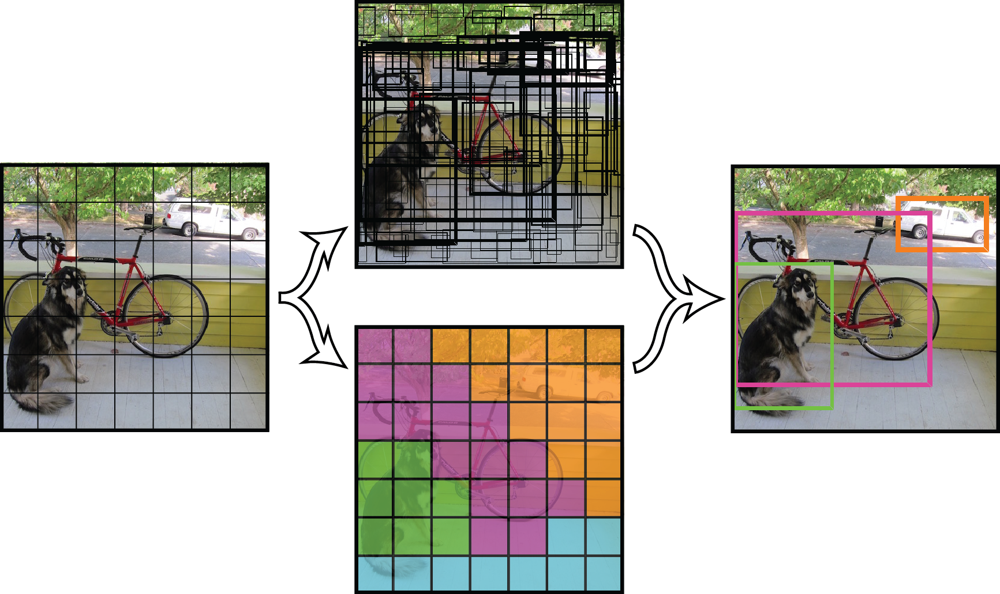
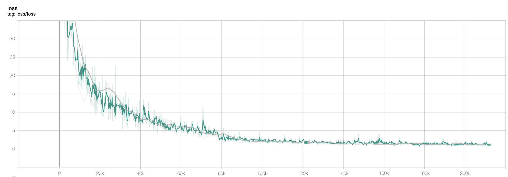
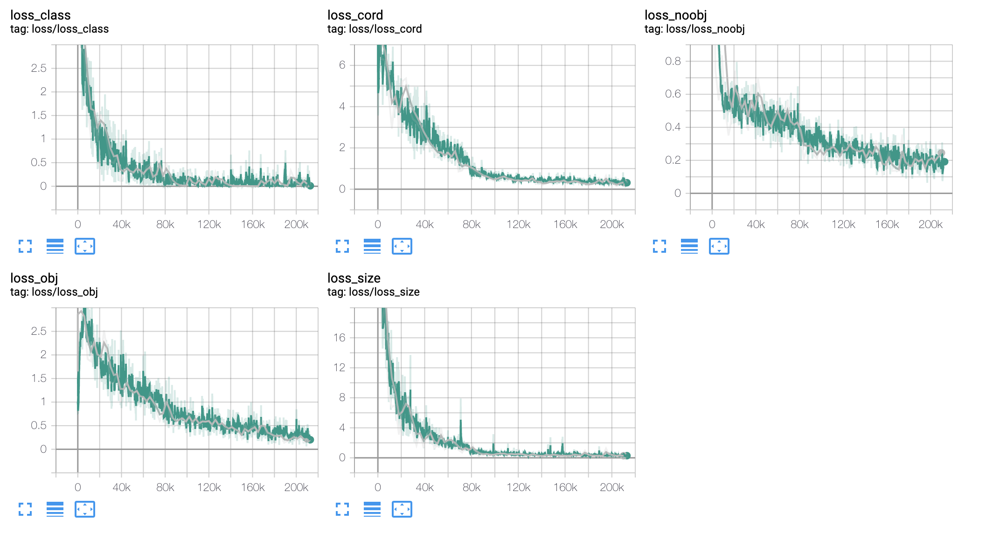

# Traffic Objects Detection

The problem of classifying and localizing objects is called object detection and it has been thriving the last couple of years. 
These solutions were deployed over many business fields and even gave birth to new ones like autonomous driving. 
The object detection and image classifying systems in certain conditions can even match the human's abilities and that's all thanks to deep convolution neural network. 

The goal is to create a system, which could detect traffic objects in a given video feed.
The purposed classes for our object detection system are these following
- car
- bus
- bike
- motorbike
- pedestrian   
- traffic light
- traffic sign

## YOLOv3

YOLO (You only look once) algorithm has been a revolutionary object detection methods. 
It was one of the first methods which just processed and looked at the image once and predicted object bounding boxes.

YOLO algorithm works by splitting the image into equally sized grid cells, where each cell is responsible for predicting the objects which center lays within the cell region.

## Model

In the YOLOv3 has been purposed deep learning model Darknet53, which is inspired by Resnet architecture and use powerful residual blocks.

The weaker link of the YOLO algorithm is leveraging a prediction of various sized objects. 
Since we split images into fixed-sized of grid cells, the predictor can have problems with inferring the bounding boxes for small, respectively big objects.

Upon the Darknet53 model, we introduce prediction across scales, which extends the model and returns 3 different fixed-sized predictions for each image.
The details of the network are described in the diagram model above.

## Datasets

The data which I used for training our traffic object detection system are two sources:
 - [Udacity-self-driving-dataset](https://github.com/udacity/self-driving-car/tree/master/annotations)
 - [RoVit-traffic-dataset](http://www.rovit.ua.es/dataset/traffic/) 

The Udacity dataset I used for proof of concept and then the main training has been done on the merge of Udacity and RoVit datasets.

## Training

The training phase has been the most time-consuming. Fortunately, I could use CTU's RCI computer with Tesla GPUs which made the training process way faster.

This model has been trained with learning rate 0.01, batch size 32 and every 40 epochs we have reduced the learning rate by a factor of ten.

In the charts below, we can see all the loss subcomponents decreasing which is an indicator that our model is successful learning the task ob object detection. 

## Detector

We have created `Detector` object which is able to train the weights for new detector on a given dataset. 

The dataset is processed by tf.Dataset which speeds up the training process because it optimizes the data preprocessing and directly feeds the into GPU, consequently achieving higher GPU utilization.  

After the training process and generating network weights, you can use the Detector as a predictor for the image's bounding boxes. You can see the process of prediction while processing the video feed in the `video_detector.py` demo.

## Future work

I have noticed a bug probably in the image preporcessing phase and the prediction across scale is not fully function. 
After fully functioning object detection, I want to add a tracking system based on SORT (Simple Online and Realtime Tracking). 

### Credits

[YOLOv1-paper](https://arxiv.org/abs/1506.02640)

[YOLOv2-paper](https://arxiv.org/abs/1612.08242)

[YOLOv3-paper](https://pjreddie.com/media/files/papers/YOLOv3.pdf)

[Darknet-diagram](https://towardsdatascience.com/yolo-v3-object-detection-53fb7d3bfe6b)
